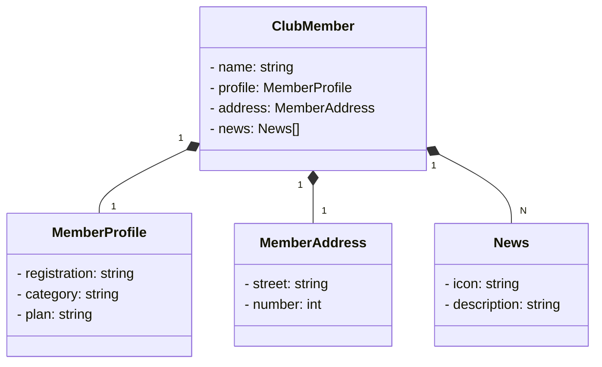

# Santander Bootcamp 2023 - Backend / Simulação Sócio - Torcedor Flamengo
Java RESTful API criada para o Santander Bootcamp 2023 -Backend.

## Diagrama de Classes

```mermaid
classDiagram
    class ClubMember {
        - name: string
        - profile: MemberProfile
        - address: MemberAddress
        - news: News[]
    }

    class MemberProfile {
        - registration: string
        - category: string
        - plan: string
    }

    class MemberAddress {
        - street: string
        - number: int
    }

    class News {
        - icon: string
        - description: string
    }

     ClubMember "1" *-- "1" MemberProfile
     ClubMember "1" *-- "1" MemberAddress
     ClubMember "1" *-- "N" News
```
